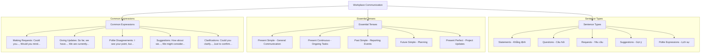

# 📌 **Sơ đồ giao tiếp trong môi trường làm việc bằng tiếng Anh**  

```mermaid
graph TD
    A[Workplace Communication] --> B[Sentence Types]
    A --> C[Essential Tenses]
    A --> D[Common Expressions]

    subgraph Sentence Types
        B1[Statements - Khẳng định]
        B2[Questions - Câu hỏi]
        B3[Requests - Yêu cầu]
        B4[Suggestions - Gợi ý]
        B5[Polite Expressions - Lịch sự]
        
        B --> B1
        B --> B2
        B --> B3
        B --> B4
        B --> B5
    end

    subgraph Essential Tenses
        C1[Present Simple - General Communication]
        C2[Present Continuous - Ongoing Tasks]
        C3[Past Simple - Reporting Events]
        C4[Future Simple - Planning]
        C5[Present Perfect - Project Updates]
        
        C --> C1
        C --> C2
        C --> C3
        C --> C4
        C --> C5
    end

    subgraph Common Expressions
        D1[Making Requests: Could you..., Would you mind...]
        D2[Giving Updates: So far, we have..., We are currently...]
        D3[Polite Disagreements: I see your point, but...]
        D4[Suggestions: How about we..., We might consider...]
        D5[Clarifications: Could you clarify..., Just to confirm...]
        
        D --> D1
        D --> D2
        D --> D3
        D --> D4
        D --> D5
    end
```

